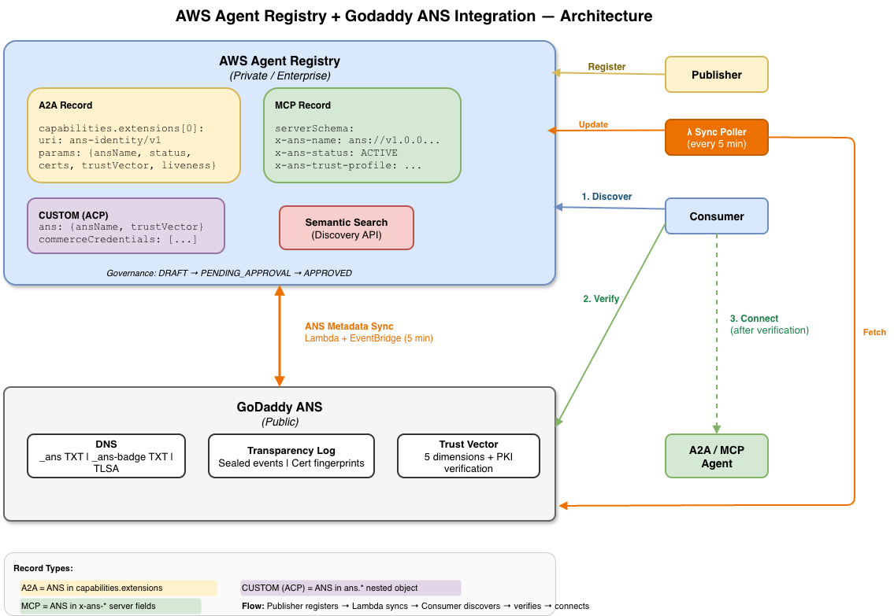
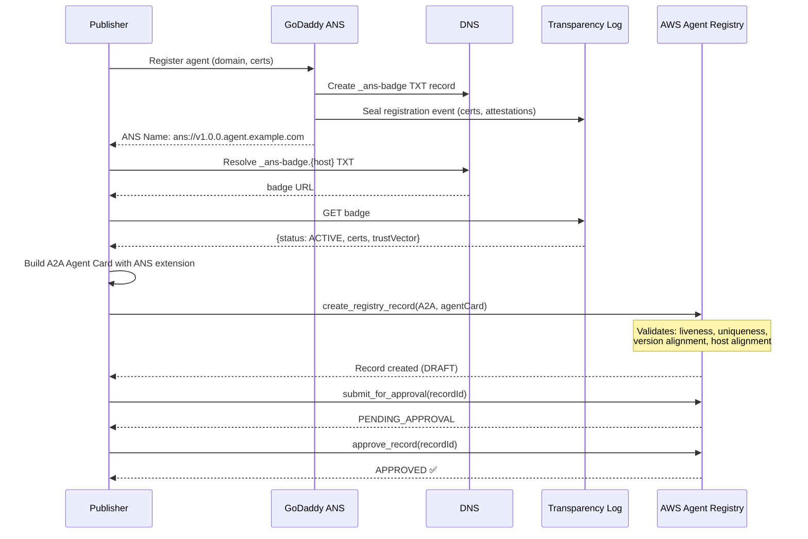
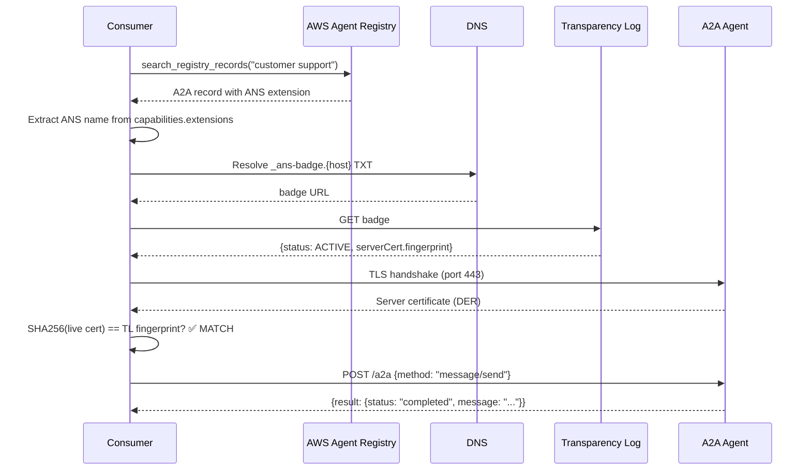
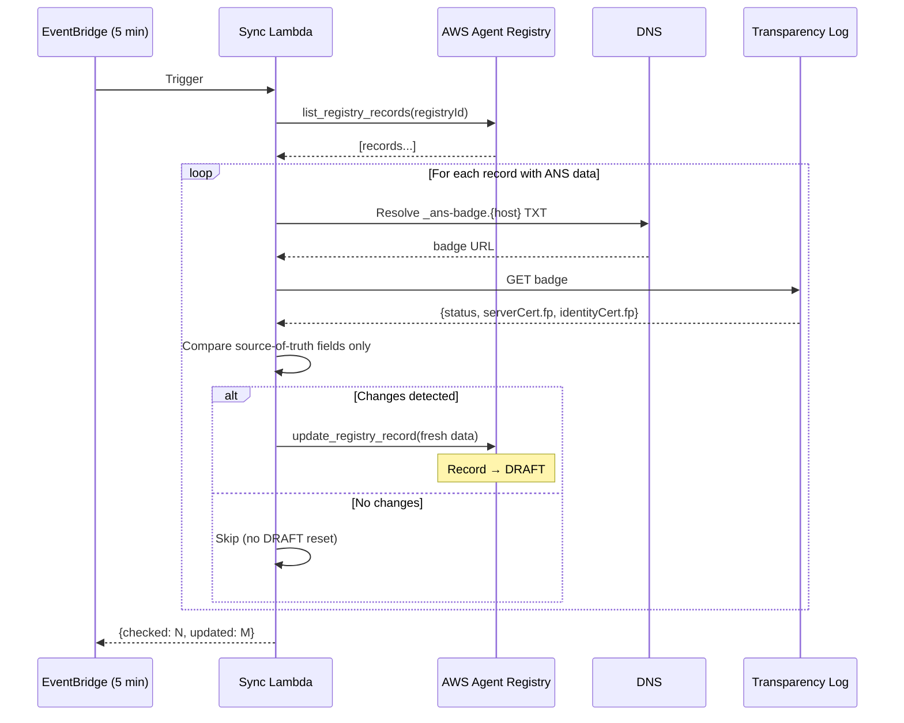
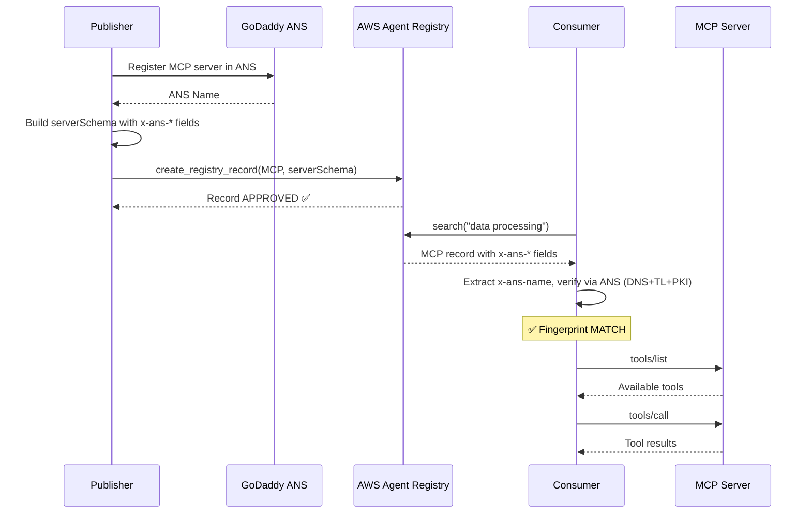

# AWS Agent Registry + ANS Integration Design

## Overview

This project integrates AWS Agent Registry (private/enterprise registry) with the GoDaddy Agent Naming Service (ANS, public registry). AWS Agent Registry serves as the enterprise discovery layer with governance and approval workflows, while ANS provides public DNS-based discovery, trust scoring, and cryptographic verification.

The integration adds ANS metadata to AWS Agent Registry records and keeps them in sync.

## Architecture



## Data Flow

### Flow 1: Publish Agent with GoDaddy ANS Metadata



### Flow 2: Consumer — Discover → Verify → Call



### Flow 3: GoDaddy ANS Metadata Sync (Lambda)



### Flow 4: MCP Server with GoDaddy ANS



## Components

### 1. `registry_client.py` — AWS Agent Registry Client

Wraps the `boto3` `bedrock-agentcore-control` and `bedrock-agentcore` APIs:

- `create_registry(name, description)` → registry ID
- `create_record(registry_id, name, agent_card, version)` → record ID
- `update_record_metadata(registry_id, record_id, custom_metadata)` → updates ANS fields
- `submit_for_approval(registry_id, record_id)`
- `approve_record(registry_id, record_id, reason)`
- `search_records(registry_id, query)` → list of records with ANS metadata
- `get_record(registry_id, record_id)` → full record with ANS metadata

### 2. `ans_sync.py` — ANS ↔ Registry Sync Service

Fetches ANS metadata and writes it to AWS Registry records:

- `fetch_ans_metadata(ans_name)` → dict of ANS fields from DNS + TL
- `sync_ans_to_registry(registry_id, record_id, ans_name)` → updates record
- `poll_ans_changes(registry_id, records)` → checks for ANS updates, syncs

### 3. `discovery.py` — Unified Discovery (Registry + ANS Verification)

Replaces GoDaddy's semantic search with AWS Registry search, then uses ANS for verification:

- `discover(registry_id, query)` → search AWS Registry
- `verify(ans_name)` → run ANS verification (DNS + TL + PKI)
- `discover_and_verify(registry_id, query)` → end-to-end

### 4. `demo.py` — End-to-End Demo

Demonstrates the full flow:
1. Create a registry
2. Create a record for the GoDaddy demo agent
3. Sync ANS metadata into the record
4. Approve the record
5. Search for it via AWS Registry
6. Verify via ANS
7. Talk to the agent via A2A

## Record Schema

AWS Agent Registry supports four descriptor types: `MCP`, `A2A`, `AGENT_SKILLS`, and `CUSTOM`. The A2A Agent Card schema supports an **extensions** mechanism (per the A2A protocol spec) that allows adding custom structured data without breaking schema validation.

### Approach: A2A Record with ANS Extension

The A2A Agent Card has a `capabilities.extensions` array where each extension is identified by a URI and carries custom `params`. We define an ANS extension that embeds all ANS metadata directly in the standard A2A agent card:

```python
a2a_agent_card = json.dumps({
    "protocolVersion": "0.3.0",
    "name": "Customer Support Agent",
    "description": "Answers questions about products and services",
    "url": "https://support-abc.helpagent.club/a2a",
    "version": "1.0.0",
    "capabilities": {
        "streaming": False,
        "extensions": [
            {
                "uri": "https://ans-protocol.org/ext/ans-identity/v1",
                "description": "ANS public identity, trust verification, and trust scores",
                "required": False,
                "params": {
                    "ansName": "ans://v1.0.0.support-abc.helpagent.club",
                    "host": "support-abc.helpagent.club",
                    "version": "1.0.0",
                    "status": "ACTIVE",
                    "domainValidation": "ACME-DNS-01",
                    "registeredAt": "2026-04-17T14:38:03Z",
                    "badgeUrl": "https://transparency.ans.godaddy.com/v1/agents/97949c1c-...",
                    "identityCert": {
                        "type": "X509-OV-CLIENT",
                        "fingerprint": "SHA256:ebae7ad8..."
                    },
                    "serverCert": {
                        "type": "X509-DV-SERVER",
                        "fingerprint": "SHA256:d8303a29..."
                    },
                    "trustVector": {
                        "integrity": 80,
                        "identity": 50,
                        "solvency": 0,
                        "behavior": 50,
                        "safety": 40
                    },
                    "trustComposite": 44.0,
                    "trustProfile": "UNTRUSTED",
                    "syncedAt": "2026-04-22T10:00:00Z"
                }
            }
        ]
    },
    "defaultInputModes": ["text/plain"],
    "defaultOutputModes": ["text/plain"],
    "skills": [
        {"id": "answer-questions", "name": "Answer Questions",
         "description": "Answer customer questions about products"},
        {"id": "order-lookup", "name": "Order Lookup",
         "description": "Look up order status and details"}
    ]
})

# Create the A2A record in AWS Agent Registry
cp_client.create_registry_record(
    registryId=REGISTRY_ID,
    name="customer-support-agent",
    description="Customer support agent with ANS public identity and trust verification",
    descriptorType="A2A",
    descriptors={
        "a2a": {
            "agentCard": {
                "schemaVersion": "0.3",
                "inlineContent": a2a_agent_card,
            }
        }
    },
    recordVersion="1.0.0",
)
```

### Why A2A Extensions (not CUSTOM type)

| Approach | Pros | Cons |
|----------|------|------|
| **A2A + extensions** (recommended) | Standard A2A schema, validated by registry, single record, extensions are part of the A2A spec | AWS Registry must allow `extensions` to pass schema validation |
| CUSTOM type | Free-form JSON, no validation issues | Loses A2A schema validation, not discoverable as an A2A agent |
| Two records (A2A + CUSTOM) | Strict A2A compliance + ANS data | Two records to manage, harder to keep in sync |

### ANS Extension URI

The extension is identified by: `https://ans-protocol.org/ext/ans-identity/v1`

Per the A2A extension spec, the URI serves as both the identifier and the location where the extension specification is hosted. The `params` object carries all ANS metadata.

### Update Flow (ANS Sync)

When ANS metadata changes, update the A2A record's agent card with refreshed extension params:

```python
# Fetch current agent card, update the ANS extension params
updated_card = current_card.copy()
for ext in updated_card["capabilities"]["extensions"]:
    if ext["uri"] == "https://ans-protocol.org/ext/ans-identity/v1":
        ext["params"]["status"] = new_status
        ext["params"]["trustVector"] = new_trust_vector
        ext["params"]["syncedAt"] = datetime.utcnow().isoformat() + "Z"
        break

cp_client.update_registry_record(
    registryId=REGISTRY_ID,
    recordId=RECORD_ID,
    descriptors={
        "a2a": {
            "agentCard": {
                "schemaVersion": "0.3",
                "inlineContent": json.dumps(updated_card),
            }
        }
    },
)
# Record status resets to DRAFT after mutation
# Must be re-submitted for approval
```

### Versioning Behavior

- AWS Registry records have a `recordVersion` field (e.g., "1.0.0")
- When `customMetadata` is updated (ANS sync), the record mutates and goes back to **DRAFT**
- This is by design — the curator must re-approve after ANS metadata changes
- For auto-approved registries, this happens transparently
- The `ans_synced_at` timestamp tracks when the last sync occurred

## Sync Strategy

### Option A: Polling (MVP)
- Cron job runs every N minutes
- For each record with `ans_name` in customMetadata:
  - Fetch `_ans-badge` DNS TXT → get badge URL
  - Fetch TL badge → get current status, cert fingerprints
  - Compare with stored `ans_synced_at` and `ans_status`
  - If changed, update customMetadata → record goes to DRAFT

### Option B: EventBridge (Production)
- ANS publishes lifecycle events to EventBridge
- Rule triggers Lambda that updates the AWS Registry record
- Lower latency, no polling overhead

### What Triggers a Sync
- ANS agent registered (new `AGENT_REGISTERED` event)
- ANS agent version bumped (new version, new identity cert)
- ANS agent renewed (cert renewal, same version)
- ANS agent revoked (`AGENT_REVOKED` event)
- ANS agent deprecated (`AGENT_DEPRECATED` event)

## Discovery Flow (Consumer)

```
1. Consumer searches AWS Agent Registry:
   search_registry_records(query="customer support")

2. Registry returns matching APPROVED records with ANS metadata:
   {
     "name": "customer-support-agent",
     "customMetadata": {
       "ans_name": "ans://v1.0.0.support-abc.helpagent.club",
       "ans_status": "ACTIVE",
       "ans_trust_profile": "UNTRUSTED",
       ...
     }
   }

3. Consumer extracts ans_name from the record

4. Consumer runs ANS verification (DNS + TL + PKI):
   - Same flow as before — fingerprint matching, TL badge, etc.

5. If verified, consumer connects via A2A endpoint from _ans TXT record
```

The key difference from the standalone ANS flow: **discovery happens via AWS Registry** (private, governed, semantic search with approval workflow), while **verification and connection happen via ANS** (public, DNS-based, cryptographic).

## File Structure

```
aws-registry-ans-integration/
├── DESIGN.md              ← This file
├── registry_client.py     ← AWS Agent Registry API wrapper
├── ans_sync.py            ← ANS metadata sync service
├── discovery.py           ← Unified discovery (Registry search + ANS verify)
├── demo.py                ← End-to-end demo script
└── requirements.txt       ← Dependencies
```

## Prerequisites

- AWS account with Bedrock AgentCore access
- `boto3` with `bedrock-agentcore-control` and `bedrock-agentcore` service clients
- `dnspython` for ANS DNS resolution
- `requests` for TL badge fetching
- A registry created in AWS Agent Registry
