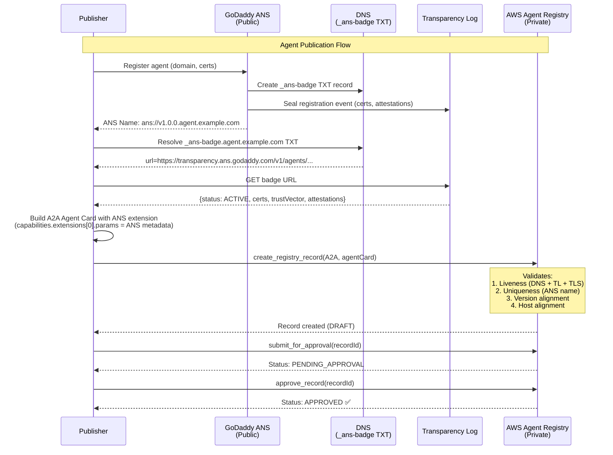
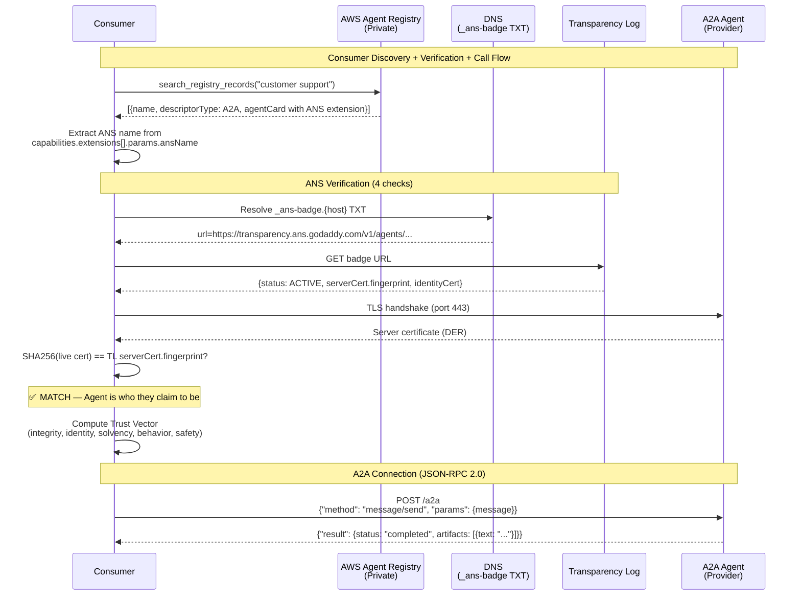
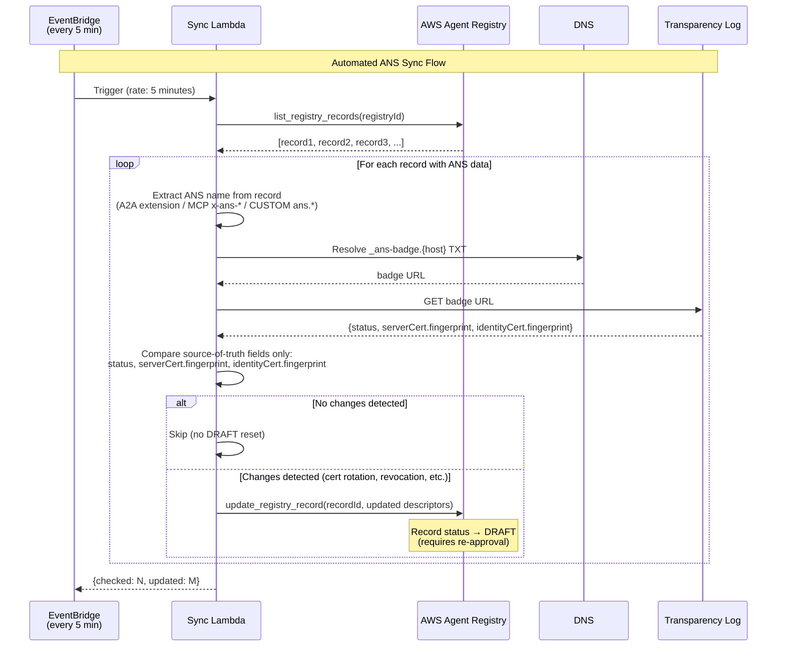
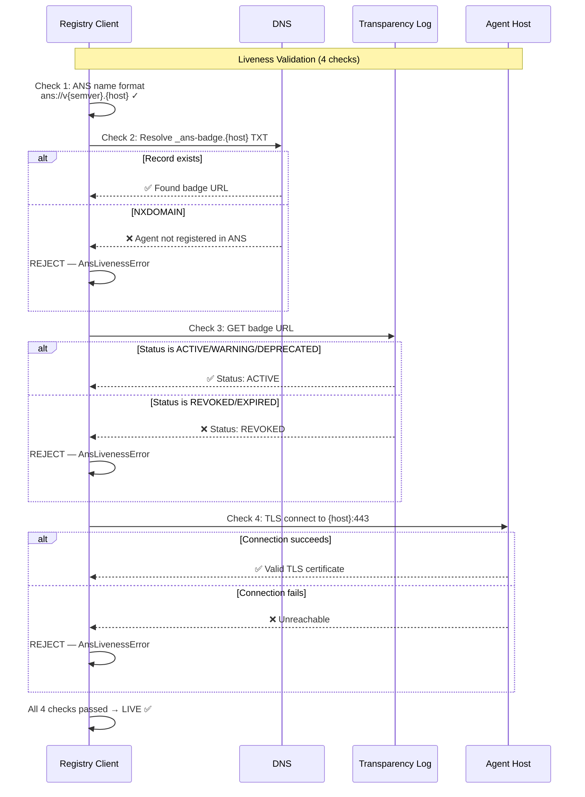
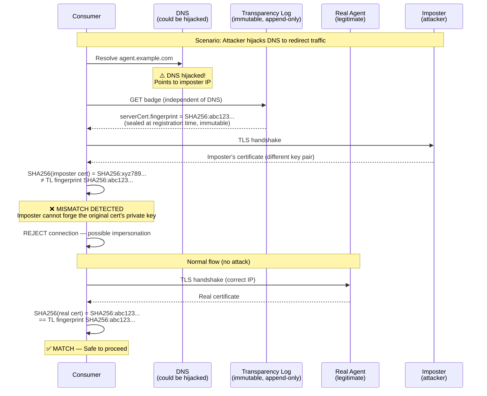
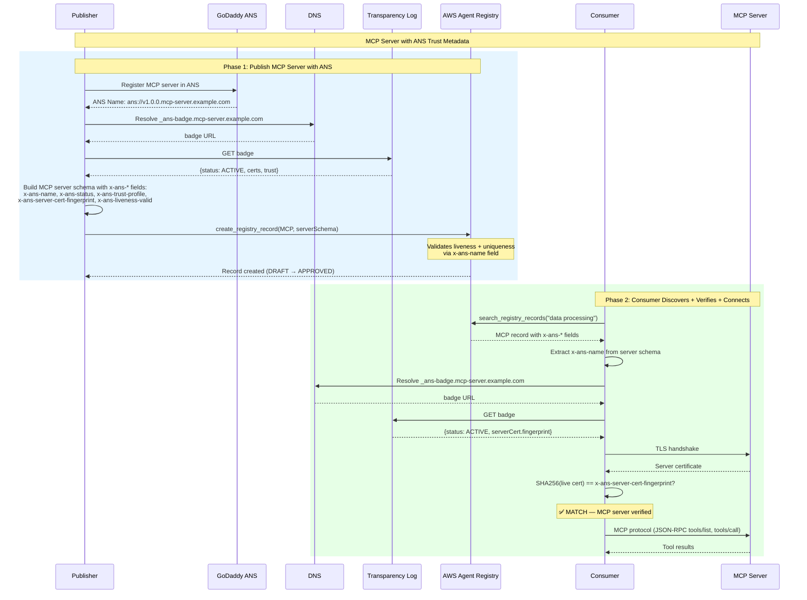
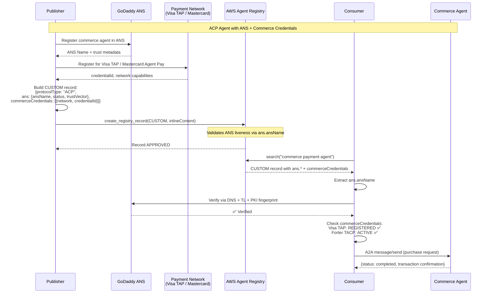
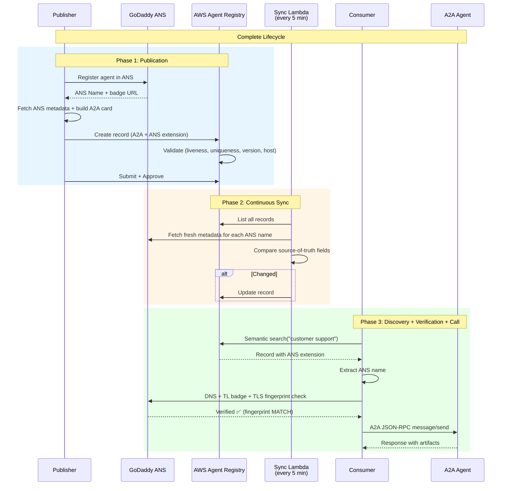

# Creating a Private Enterprise Agent Registry Using AWS Agent Registry and GoDaddy Agent Name Service (ANS)

## Overview

This tutorial demonstrates integrating **AWS Agent Registry** (private/enterprise agent catalog) with **GoDaddy's Agent Name Service (ANS)** (public DNS-based agent discovery and trust verification). The integration enables enterprises to:

1. **Register** agents in AWS Agent Registry with GoDaddy ANS public identity metadata
2. **Discover** agents via AWS Registry semantic search with trust scores visible
3. **Verify** agent identity via GoDaddy ANS (DNS + Transparency Log + PKI fingerprint matching)
4. **Connect** to verified agents via A2A protocol
5. **Sync** GoDaddy ANS metadata automatically via Lambda + EventBridge (every 5 minutes)

### Why Integrate GoDaddy ANS with AWS Agent Registry?

- **AWS Agent Registry** = private/enterprise discovery with governance (approval workflows, semantic search, access control)
- **GoDaddy ANS** = public discovery with cryptographic trust verification (domain validation, Transparency Log, cert fingerprints)
- Together: enterprise agents get governed internal discovery AND public trust verification

### Tutorial Details

| Information | Details |
|:---|:---|
| Tutorial type | Registry Integration with External Trust Service |
| AgentCore components | AWS Agent Registry |
| External services | GoDaddy ANS (DNS, Transparency Log), A2A Agent |
| Inbound Auth | IAM |
| LLM model | N/A (no LLM required) |
| Tutorial components | AWS Agent Registry, Lambda, EventBridge, CloudWatch Logs |
| Tutorial vertical | Cross-vertical (Agent Identity & Trust) |
| Example complexity | Advanced |
| SDK used | boto3, dnspython, requests |

## Architecture


## Sequence Diagrams

### Flow 1: Publishing — Register Agent with GoDaddy ANS Metadata

The publisher registers an agent in GoDaddy ANS (public), fetches the metadata, and creates a governed record in AWS Agent Registry (private).



### Flow 2: Discovery + Verification + Connection (Consumer)

The consumer discovers an agent via AWS Registry semantic search, verifies it via GoDaddy ANS, and connects via A2A.



### Flow 3: GoDaddy ANS Metadata Sync (Lambda + EventBridge)

The sync poller keeps AWS Registry records up-to-date with the latest GoDaddy ANS state (status, cert fingerprints).



### Flow 4: Liveness Validation (Pre-Registration)

Before any record is created or updated, the system validates the GoDaddy ANS name is live and valid.



### Flow 5: PKI Fingerprint Anti-Impersonation

The fingerprint matching mechanism prevents DNS hijacking and man-in-the-middle attacks.



### Flow 6: MCP Server Registration + Discovery with GoDaddy ANS

MCP servers use `x-ans-*` custom fields in the server schema instead of A2A extensions.



### Flow 7: ACP (Commerce Agent) via CUSTOM Type

Agents with commerce credentials (Visa TAP, Mastercard Agent Pay) use CUSTOM type with an `ans.*` nested object.



### Flow 8: End-to-End Overview (All Actors)

Complete lifecycle showing publication, sync, discovery, verification, and connection.



## Key Features

- **ANS Extension in A2A Agent Card** — GoDaddy ANS metadata stored as a standard A2A protocol extension (`capabilities.extensions`), passing schema validation
- **Liveness validation** — Before registration, verifies the GoDaddy ANS name is live (DNS resolvable, TL badge reachable, TLS connectable)
- **Duplicate detection** — GoDaddy ANS name is treated as a primary key; rejects duplicate registrations
- **Version alignment** — GoDaddy ANS version (from `ans://v1.0.0.host`) must match the registry record version
- **Host alignment** — Agent card URL host must match the GoDaddy ANS host
- **Source-of-truth sync** — Lambda only updates records when GoDaddy ANS status or cert fingerprints actually change (avoids false DRAFT resets)
- **Multi-format support** — Sync works for A2A (extensions), MCP (x-ans-* fields), and CUSTOM/ACP records
- **Trust Vector** — 5 dimensions (integrity, identity, solvency, behavior, safety) computed from live GoDaddy ANS signals

## Prerequisites

- AWS account with Amazon Bedrock AgentCore access (Agent Registry)
- Python 3.10+
- boto3 >= 1.42.87
- Internet access (for DNS queries and HTTPS to GoDaddy ANS Transparency Log)

### Required IAM Permissions

```json
{
    "Version": "2012-10-17",
    "Statement": [
        {
            "Sid": "BedrockAgentCoreAccess",
            "Effect": "Allow",
            "Action": [
                "bedrock-agentcore:*",
                "bedrock-agentcore-control:*"
            ],
            "Resource": "*"
        },
        {
            "Sid": "LambdaManagement",
            "Effect": "Allow",
            "Action": [
                "lambda:CreateFunction",
                "lambda:UpdateFunctionCode",
                "lambda:UpdateFunctionConfiguration",
                "lambda:InvokeFunction",
                "lambda:AddPermission",
                "lambda:DeleteFunction"
            ],
            "Resource": "arn:aws:lambda:*:*:function:ans-registry-sync-poller"
        },
        {
            "Sid": "EventBridgeManagement",
            "Effect": "Allow",
            "Action": [
                "events:PutRule",
                "events:PutTargets",
                "events:DeleteRule",
                "events:RemoveTargets"
            ],
            "Resource": "arn:aws:events:*:*:rule/ans-registry-sync-*"
        },
        {
            "Sid": "IAMRoleManagement",
            "Effect": "Allow",
            "Action": [
                "iam:CreateRole",
                "iam:PutRolePolicy",
                "iam:PassRole"
            ],
            "Resource": "arn:aws:iam::*:role/ans-registry-sync-poller-role"
        },
        {
            "Sid": "CloudWatchLogs",
            "Effect": "Allow",
            "Action": [
                "logs:DescribeLogStreams",
                "logs:GetLogEvents"
            ],
            "Resource": "arn:aws:logs:*:*:log-group:/aws/lambda/ans-registry-sync-poller:*"
        },
        {
            "Sid": "STSAccess",
            "Effect": "Allow",
            "Action": "sts:GetCallerIdentity",
            "Resource": "*"
        }
    ]
}
```

## Getting Started

### Step 1: Install Dependencies

```bash
pip install -r requirements.txt
```

### Step 2: Configure AWS Credentials

```bash
export AWS_ACCESS_KEY_ID="your-key"
export AWS_SECRET_ACCESS_KEY="your-secret"
export AWS_DEFAULT_REGION="us-east-1"
```

### Step 3: Run the End-to-End Publishing Demo

```bash
python demo.py --region us-east-1
```

This will:
1. Create a registry (`ans-integration-demo`) with auto-approval
2. Fetch live ANS metadata for the GoDaddy demo agent
3. Build an A2A agent card with the ANS extension (including liveness + trust vector)
4. Create the record (validates: liveness, uniqueness, version alignment, host alignment)
5. Submit and approve the record
6. Search for it via semantic search
7. Print the full record with ANS extension

### Step 4: Run the Consumer Test (Discover → Verify → Call)

```bash
python discover_verify_call.py --registry-id <your-registry-id> --query "customer support"
```

This demonstrates the **runtime consumer flow**:
1. **DISCOVER** — Semantic search in AWS Agent Registry for an agent matching the query
2. **EXTRACT** — Pull the GoDaddy ANS name from the record's A2A extension (`capabilities.extensions`)
3. **VERIFY** — Full GoDaddy ANS verification: DNS resolution, Transparency Log badge, PKI fingerprint matching
4. **CALL** — Send an A2A JSON-RPC `message/send` to the verified agent and print the response

Example output:
```
██████████████████████████████████████████████████████████████████████
  AWS Agent Registry + ANS: Discover → Verify → Call
  ──────────────────────────────────────────────────────────────────
  Registry:  <your-registry-id>
  Query:     "customer support agent"
██████████████████████████████████████████████████████████████████████

  STEP 1: DISCOVER — Search AWS Agent Registry
  ✅ Found agent: godaddy-support-agent-ans

  STEP 2: EXTRACT — Pull ANS name from registry record
  ANS Name: ans://v1.0.0.support-a08c16a8-f972-472f-b95f-3debacfcb201.helpagent.club

  STEP 3: VERIFY — Validate agent via ANS
    ✅ ANS name format: version=1.0.0, host=support-...
    ✅ DNS _ans-badge TXT: Found
    ✅ Transparency Log badge: Status: ACTIVE
    ✅ TLS reachability: Connected to host:443
    ✅ MATCH — Agent is who they claim to be
    Trust Profile: UNTRUSTED (composite: 44.0)

  STEP 4: CALL — Send A2A message to verified agent
  🤖 Agent Reply: I'm here to assist you with a variety of customer service needs...

  END-TO-END SUMMARY
  1. DISCOVER:  Found 'godaddy-support-agent-ans' in AWS Registry
  2. EXTRACT:   ANS Name = ans://v1.0.0.support-...
  3. VERIFY:    Status=ACTIVE, FP=MATCH, Trust=UNTRUSTED
  4. CALL:      ✅ Success
```

### Step 5: Deploy the Sync Poller (Lambda + EventBridge)

```bash
python deploy_poller.py --registry-id <your-registry-id> --region us-east-1
```

This deploys:
- **Lambda function** (`ans-registry-sync-poller`) — checks all records with GoDaddy ANS data every 5 minutes
- **EventBridge rule** (`ans-registry-sync-every-5min`) — triggers the Lambda on schedule
- **IAM role** (`ans-registry-sync-poller-role`) — permissions for Registry + CloudWatch Logs

The poller only updates records when the GoDaddy ANS **source of truth** changes (status, cert fingerprints) — not when locally-computed trust scores differ. This prevents unnecessary DRAFT resets.

## How It Works

### GoDaddy ANS Extension in A2A Agent Card

GoDaddy ANS metadata is stored as a standard A2A protocol extension:

```json
{
  "protocolVersion": "0.3.0",
  "name": "My Agent",
  "url": "https://my-agent.example.com/a2a",
  "capabilities": {
    "extensions": [{
      "uri": "https://ans-protocol.org/ext/ans-identity/v1",
      "description": "ANS public identity, trust verification, and liveness",
      "required": false,
      "params": {
        "ansName": "ans://v1.0.0.my-agent.example.com",
        "host": "my-agent.example.com",
        "version": "1.0.0",
        "status": "ACTIVE",
        "domainValidation": "ACME-DNS-01",
        "identityCert": {"type": "X509-OV-CLIENT", "fingerprint": "SHA256:..."},
        "serverCert": {"type": "X509-DV-SERVER", "fingerprint": "SHA256:..."},
        "trustVector": {"integrity": 80, "identity": 50, "solvency": 0, "behavior": 50, "safety": 40},
        "trustComposite": 44.0,
        "trustProfile": "UNTRUSTED",
        "liveness": {
          "valid": true,
          "dnsResolvable": true,
          "tlBadgeReachable": true,
          "tlsReachable": true,
          "formatValid": true,
          "checkedAt": "2026-04-22T12:00:00Z"
        },
        "syncedAt": "2026-04-22T12:00:00Z"
      }
    }]
  }
}
```

### Validation Rules (enforced on create/update)

| Rule | What It Checks | Error |
|:---|:---|:---|
| **Liveness** | DNS _ans-badge exists, TL badge reachable + ACTIVE, TLS connectable | `AnsLivenessError` (422) |
| **Uniqueness** | No other record in the registry has the same ANS name | `AnsNameConflictError` (409) |
| **Version alignment** | ANS version matches record version | `AnsVersionMismatchError` (400) |
| **Host alignment** | Agent card URL host matches ANS host | `AnsHostMismatchError` (400) |

### Sync Poller Logic

The Lambda runs every 5 minutes and for each record with GoDaddy ANS data:

1. Extracts the GoDaddy ANS name (supports A2A extensions, MCP x-ans-* fields, CUSTOM ans.* objects)
2. Fetches the TL badge from GoDaddy's Transparency Log
3. Compares **only source-of-truth fields**: `status`, `serverCert.fingerprint`, `identityCert.fingerprint`
4. If nothing changed → skip (no DRAFT reset)
5. If something changed → update the record with fresh data

### MCP Records with GoDaddy ANS

MCP server schemas support custom fields via `x-` prefix:

```json
{
  "name": "io.example/my-mcp-server",
  "version": "1.0.0",
  "x-ans-name": "ans://v1.0.0.my-server.example.com",
  "x-ans-status": "ACTIVE",
  "x-ans-trust-profile": "TRANSACTIONAL",
  "x-ans-liveness-valid": true
}
```

### ACP (Agentic Commerce Protocol) via CUSTOM

For agents with commerce credentials (Visa TAP, Mastercard Agent Pay, Forter TACP):

```json
{
  "protocolType": "ACP",
  "protocolVersion": "0.1.0",
  "name": "Commerce Agent",
  "ans": { "ansName": "...", "status": "ACTIVE", "trustVector": {...} },
  "commerceCredentials": [
    {"network": "visa-tap", "status": "REGISTERED", "credentialId": "..."},
    {"network": "forter-tacp", "status": "ACTIVE", "credentialId": "..."}
  ]
}
```

## Cleanup

To remove all resources created by this tutorial:

```bash
# Delete the Lambda and EventBridge rule
aws lambda delete-function --function-name ans-registry-sync-poller --region us-east-1
aws events remove-targets --rule ans-registry-sync-every-5min --ids ans-sync-lambda --region us-east-1
aws events delete-rule --name ans-registry-sync-every-5min --region us-east-1
aws iam delete-role-policy --role-name ans-registry-sync-poller-role --policy-name ans-sync-permissions
aws iam delete-role --role-name ans-registry-sync-poller-role

# Delete registry records and registry via boto3
```

## Resources

- [AWS Agent Registry documentation](https://docs.aws.amazon.com/bedrock-agentcore/latest/devguide/registry.html)
- [GoDaddy ANS Registry (GitHub)](https://github.com/godaddy/ans-registry)
- [GoDaddy ANS Rust SDK](https://github.com/godaddy/ans-sdk-rust)
- [A2A Protocol Extensions](https://a2a-protocol.org/latest/topics/extensions/)
- [IETF ANS Draft](https://datatracker.ietf.org/doc/html/draft-narajala-ans-00)
- [Strands Agents SDK](https://github.com/strands-agents/sdk-python)
